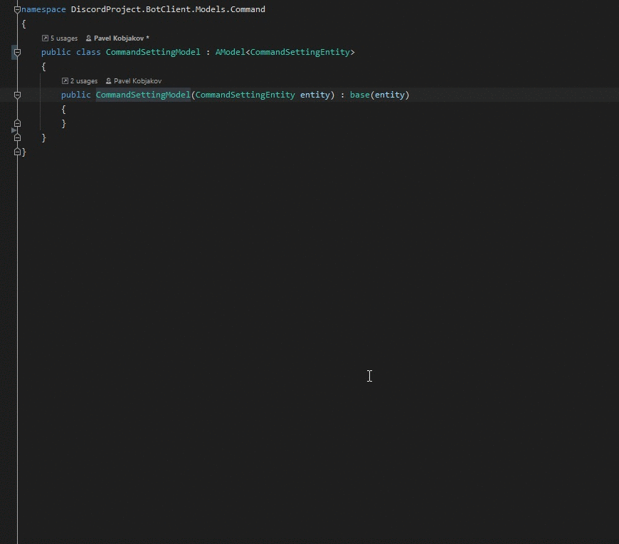

# PrismAnalyzer
Allows you to automatically wrap entity class properties in binding models

## Convention
All classes that will be wrapped in the model must inherit the base class, the name of which must contain "Entitiy".
All classes that are used as wrappers must inherit the base class whose name contains "Model", whose constructor has an instance of the entity, and inherit the base class

## Exmaple

